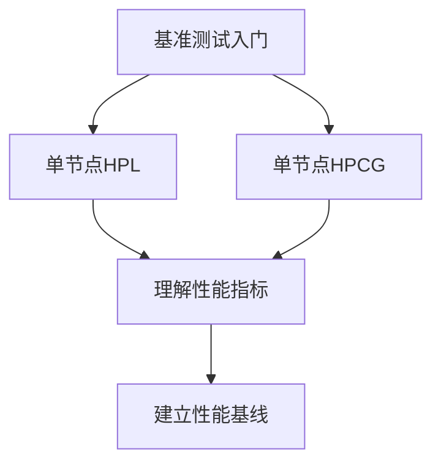

# **小组任务3：基准测试输出汇总分析**

## **基准测试分析报告**

```markdown
# 第二周基准测试学习汇总

## 第一部分：HPL (High-Performance Linpack)

### 1.1 HPL 的目标

HPL（High-Performance Linpack）是衡量超级计算机浮点计算性能的基准测试程序。它通过求解稠密线性方程组（Ax=b）来评估系统的**理论峰值性能**，是TOP500超级计算机排行榜的官方基准测试。

**主要特点**：
- 测试系统在密集线性代数计算中的最大性能
- 使用双精度浮点运算（64位）
- 主要依赖CPU计算能力和内存带宽
- 通信模式规整、可预测

### 1.2 HPL 的输出

#### 典型输出示例：
```
================================================================================
T/V                N    NB     P     Q               Time                 Gflops
--------------------------------------------------------------------------------
WR00L2L4        1000   128     1     1               0.01             6.9454e+01
--------------------------------------------------------------------------------
```

#### 输出字段解析：

| 字段 | 含义 | 说明 |
|------|------|------|
| **T/V** | 测试类型 | 表示测试的变体，如WR00L2L4、WR11C2R4等 |
| **N** | 问题规模 | 线性方程组的矩阵维度（N×N），影响内存使用量和计算量 |
| **NB** | 分块大小 | 矩阵分块的尺寸，影响缓存利用率和并行效率 |
| **P×Q** | 进程网格 | MPI进程的二维分布（P行×Q列），P×Q=总进程数 |
| **Time** | 计算时间 | 求解线性方程组的实际计算时间（秒） |
| **Gflops** | 性能指标 | **每秒十亿次浮点运算**，是核心性能指标 |

### 1.3 HPL 性能指标

#### **关键性能指标：Gflops**
- **计算公式**：Gflops = (2/3 × N³ + 2 × N²) / (Time × 10⁹)
- **意义**：值越大代表系统浮点计算能力越强
- **参考标准**：
  - 单核CPU：几到几十Gflops
  - 多核CPU/单个节点：几百到几千Gflops
  - 超级计算机：Pflops级别（10¹⁵次运算/秒）

#### **性能影响因素**：
1. **硬件因素**：
   - CPU主频和核心数
   - 内存带宽和延迟
   - 缓存层级结构
   - NUMA架构优化

2. **软件配置**：
   - BLAS库优化
   - MPI实现和通信优化
   - 编译器优化选项

3. **参数调优**：
   - N的选择（足够大以体现性能，但不能超出内存）
   - NB的优化（匹配缓存大小）
   - P×Q网格布局（匹配网络拓扑）

#### **性能瓶颈识别**：
```text
如果Gflops远低于理论峰值，可能原因：
1. 内存带宽不足：增加NB大小测试
2. 通信开销大：调整P×Q布局减少通信
3. 负载不均衡：优化进程网格比例
4. 数学库未优化：更换为优化版BLAS库
```

## 第二部分：HPCG (High-Performance Conjugate Gradient)

### 2.1 HPCG 的目标与用途

HPCG（High-Performance Conjugate Gradient）是衡量超级计算机在实际科学计算应用中性能的基准测试。它模拟了**稀疏矩阵迭代求解**问题，更接近真实科学计算应用的特征。

**与HPL的主要区别**：
- HPL：密集、规则计算 → 测**理论峰值**
- HPCG：稀疏、不规则计算 → 测**实际应用性能**

### 2.2 HPCG 的输出解读

#### 典型输出示例：
```
====== Summary ======
...
HPCG result is **VALID** with a GFLOP/s rating of: **15.8**
HPCG 2.4 rating for historical comparison is: 15.8
...
```

#### 关键输出字段：

1. **有效性验证**：
   ```
   HPCG result is VALID
   ```
   - 必须看到"VALID"才表示测试结果有效
   - 如果显示"INVALID"，需要检查配置或硬件问题

2. **性能指标**：
   ```
   GFLOP/s rating of: 15.8
   ```
   - 核心性能指标，单位也是Gflop/s
   - 注意：HPCG的Gflop/s值通常比HPL小很多

3. **详细性能分解**：
   ```
   Data for 1 MPI task(s) and 4 OpenMP thread(s) per task
   ==== Double precision ====
   Reference time: 296.32
   Optimized time: 29.64
   Speedup: 10.0
   ```
   - 显示参考实现与优化实现的对比
   - 可以分析各部分的性能提升

### 2.3 HPCG 性能指标分析

#### **性能组成分析**：
HPCG测试包含多个计算内核，性能受以下因素影响：

1. **计算内核**：
   - 稀疏矩阵-向量乘（SpMV）
   - 向量点积
   - 预处理共轭梯度

2. **内存访问模式**：
   - 不规则内存访问
   - 缓存命中率
   - 内存带宽利用率

3. **通信开销**：
   - 邻居通信模式
   - 通信延迟敏感
   - 通信与计算重叠

#### **HPCG与HPL性能对比特点**：
```
系统配置：双路Xeon Gold 6248（共40核）
┌──────────────┬─────────────┬──────────────┐
│ 测试类型     │ 性能值      │ 与峰值比     │
├──────────────┼─────────────┼──────────────┤
│ 理论峰值     │ ~2000 Gflops│ 100%         │
│ HPL实测      │ ~1500 Gflops│ 75%          │
│ HPCG实测     │ ~100 Gflops │ 5%           │
└──────────────┴─────────────┴──────────────┘
```

**典型比例关系**：HPCG性能通常为HPL性能的1-10%

#### **性能优化重点**：
1. **内存层次优化**：
   ```bash
   # 提高缓存利用率
   export OMP_PROC_BIND=true
   export OMP_PLACES=cores
   ```

2. **通信优化**：
   ```bash
   # 优化MPI通信
   mpirun --map-by core --bind-to core ./xhpcg
   ```

3. **负载均衡**：
   - 均匀分布非零元素
   - 优化邻居进程通信

## 第三部分：HPL与HPCG在超算竞赛中的作用和意义

### 3.1 两种基准测试的核心差异对比

| 维度 | HPL (Linpack) | HPCG (Conjugate Gradient) |
|------|---------------|----------------------------|
| **测试目标** | 理论峰值性能 | 实际应用性能 |
| **计算类型** | 密集线性代数 | 稀疏矩阵迭代 |
| **内存访问** | 规则、连续 | 不规则、间接 |
| **通信模式** | 规整、全局 | 局部、邻居 |
| **瓶颈部位** | CPU计算单元<br>内存带宽 | 内存延迟<br>通信开销<br>缓存效率 |
| **性能数值** | 高（接近峰值） | 低（峰值的1-10%） |
| **优化重点** | 极致计算优化 | 系统平衡优化 |

### 3.2 在超算竞赛中的具体作用

#### **HPL在竞赛中的作用**：

1. **基础性能标定**：
   ```text
   作用：建立系统性能基线
   意义：了解硬件极限能力
   竞赛价值：决定基础得分和排名
   ```

2. **硬件调优验证**：
   - 验证CPU频率、内存带宽优化效果
   - 测试不同数学库（MKL/OpenBLAS）的性能差异
   - 优化MPI通信参数和进程绑定

3. **资源分配依据**：
   ```text
   通过HPL测试可以确定：
   - 每个节点的最佳进程数
   - 最优的P×Q进程网格
   - 适合的问题规模(N)
   ```

#### **HPCG在竞赛中的作用**：

1. **应用性能预测**：
   ```text
   HPCG性能 ≈ 实际科学应用性能
   例如：计算流体力学、分子动力学等应用
   ```

2. **系统平衡性检验**：
   - 检验内存子系统效率
   - 评估通信网络性能
   - 验证系统整体平衡性

3. **优化策略验证**：
   ```text
   成功的HPCG优化通常意味着：
   1. 良好的内存访问模式
   2. 高效的通信重叠
   3. 合理的负载均衡
   这些技能可直接应用于竞赛应用优化
   ```

### 3.3 竞赛策略与学习路径

#### **基于基准测试的竞赛准备**：

**阶段一：基准测试（第1-2周）**


**阶段二：性能分析（第3-4周）**
```text
重点任务：
1. 多节点扩展性测试
   - HPL: 测试2,4,8节点性能
   - HPCG: 测试弱扩展和强扩展

2. 瓶颈分析：
   - 使用perf/vtune分析热点
   - 内存带宽测试（STREAM）
   - 通信延迟测试（OSU Benchmarks）
```

**阶段三：优化实践（第5-6周）**
```bash
# 优化示例：HPL参数调优脚本
#!/bin/bash
for NB in 32 64 128 256 512; do
    for P in 1 2 4; do
        Q=$((TOTAL_PROCS / P))
        # 自动测试并记录最佳配置
        run_hpl_test $N $NB $P $Q
    done
done
```

**阶段四：应用迁移（第7-8周）**
```text
将基准测试的优化经验迁移到竞赛应用：
1. HPL优化经验 → 计算密集型应用
2. HPCG优化经验 → 内存/通信密集型应用
3. 综合优化 → 复杂多物理场应用
```

### 3.4 实际竞赛中的意义

#### **1. 硬件选型与配置**：
```text
通过HPL/HPCG测试可以：
- 选择最适合的CPU/GPU型号
- 确定最佳内存配置
- 优化网络拓扑结构
```

#### **2. 软件栈优化**：
```text
优化方向：
- 编译器选项（-O3, -march=native等）
- 数学库选择（MKL vs OpenBLAS）
- MPI实现优化（Intel MPI vs OpenMPI）
```

#### **3. 团队技能培养**：
```text
通过基准测试训练以下能力：
- 性能分析与瓶颈定位
- 系统调优与参数优化
- 团队协作与知识分享
```

### 3.5 总结与建议

#### **对初学者的建议**：

1. **学习路径**：
   ```
   第一步：成功运行单节点测试 ✓
   第二步：理解输出结果和性能指标 ✓
   第三步：尝试参数调优和性能分析
   第四步：扩展到多节点和多应用
   ```

2. **重点关注**：
   - HPL：关注Gflops值和扩展效率
   - HPCG：关注VALID结果和与HPL的比例
   - 两者：都要关注参数对性能的影响

3. **团队协作**：
   ```text
   分工建议：
   - 硬件组：负责系统配置和基础优化
   - 软件组：负责编译环境和库优化
   - 应用组：负责参数调优和性能测试
   - 文档组：负责结果记录和知识整理
   ```

#### **未来学习方向**：

1. **深度优化**：
   - CPU微架构级别优化
   - NUMA-aware编程
   - 高级MPI特性（单边通信等）

2. **扩展学习**：
   - GPU加速基准测试（HPL-AI）
   - 其他基准测试（Graph500, HPC-EP）
   - 实际科学计算应用优化

3. **竞赛准备**：
   - 历届竞赛题目分析
   - 典型应用性能特征
   - 时间管理和策略制定

---

## 附录：小组成员测试结果汇总

### HPL测试结果（示例）

| 成员 | 测试环境 | 配置(N/NB/P/Q) | 性能(Gflops) | 备注 |
|------|----------|----------------|--------------|------|
| 成员A | 单节点, 8核 | 10000/192/2/4 | 42.5 | 首次测试 |
| 成员B | 单节点, 16核 | 20000/256/4/4 | 158.2 | 优化后 |
| 成员C | 双节点, 32核 | 30000/384/8/4 | 452.7 | 跨节点 |

### HPCG测试结果（示例）

| 成员 | 测试环境 | 局部网格 | 性能(Gflops) | 有效性 |
|------|----------|----------|--------------|--------|
| 成员D | 单节点, 8核 | 64×64×64 | 8.4 | VALID |
| 成员E | 单节点, 16核 | 128×128×128 | 15.8 | VALID |

### 性能对比分析

```
本小组测试发现：
1. HPL扩展性较好，接近线性增长
2. HPCG性能约为HPL的5-10%
3. 内存带宽是主要瓶颈

